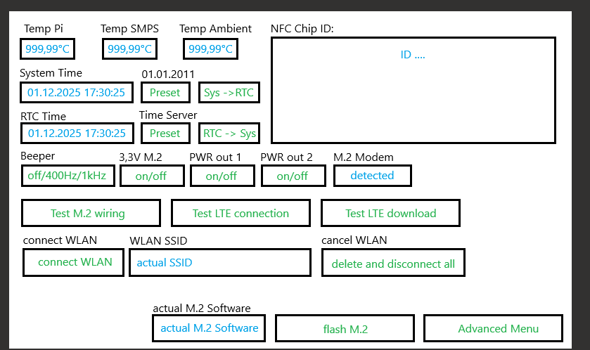

bitte die wichtigste Software der Welt erstellen.

 

System in Debian 12, du brauchst dafür teilweise die Pyton scripts vom Berni auf dem pi!

Bitte sprich dich mit Bernhard und Ingrid zusammen, einige Funktionen funktionieren schon 1:1 so am Debian, die hat der Bernhard schon fertig gemacht. Andere Funktionen (zB Temperatur auslesen und umrechnen hat bereits Ingrid gemacht, da kannst du dir von ihr die Daten dazu holen.

Manche Funktionen wirst du selber erstellen müssen, zB die Ansteuerung des Beepers, da findest du aber sicher unzählige Beispiele im Internet.

 

Also bitte eine App erstellen, wie die ausschauen soll habe ich dir angehängt.

 

Wir können gerne mal die Details durchsprechen.

 

Temp Pi: Anzeigen [xxx,xx°C] refresh mindestens alle 0,5 Sekunden, Dateninput von Ingrid holen

Temp SMPS: Anzeigen [xxx,xx°C] refresh mindestens alle 0,5 Sekunden, Dateninput von Ingrid holen

Temp Ambient: Anzeigen [xxx,xx°C] refresh mindestens alle 0,5 Sekunden, Dateninput von Ingrid holen

Sys Date/Time: Anzeigen [01.12.2025 17:30:25] 'date

RTC Date/Time: Anzeigen [01.12.2025 17:30:25] 'sudo hwclock -r

System Time -> RTC 'sudo hwclock -w

RTC -> System Time 'sudo hwclock -s

[Preset] Button RTC 'sudo hwclock --set --date="2025-12-24 13:45:30"

[Preset] Button Systime 'muss du selber rausfinden ;-)

NFC Chip ID: Anzeigen [xxxxx...] muss dir Ingrid sagen, hier bitte einfach einen Lauftext erstellen der zyklisch den NFC Sensor abfragt und die Daten dazu anzeigt. Kann dir dann noch genau erklären was ich da gern hätte.

Beeper: Button [off / 400Hz / 1kHz] 'musst dir im Internet suchen, findest du aber sicher ;-)

[3V3 for M.2 on/off] Button (GP26 on = 3V3 off; GP26 off = 3V3 on)

[PWR out 1 on/off] (GP22 on = PWR1 low; GP22 off = PWR1 open C.)

[PWR out 2 on/off] (GP23 on = PWR2 low; GP23 off = PWR2 open C.)

M.2 Modem detected '/etc/undock/connection-manager.py -detect

           Rückgabewert: 'Modem detected' oder 'Modem not detected'

 

[Test M.2] Button starts electrical test script '/etc/undock/connection-manager.py --human --electrical

[Test LTE connection] Button starts connection test '/etc/undock/connection-manager.py --human

[Test LTE download] Button starts demo download '/home/pi/Desktop/download/download.py

[flash M.2] Button starts flashing the M.2 Module '/etc/undock/connection-manager.py --human --application --revert

[actual M.2 Software] Abfrage M.2 Softwarestand? 'AT#XSLMVER

 

 

[Advanced Menü] Button

damit kommt man dann auf eine neue Sete auf der man dann jeden Pin einzeln als Ausgang/Eingang schalten kann und auf high bzw low setzen kann für spezielle Tests und Fehlersuchen.

 

Advanced Menü:

GPIO2 [IN/OUT] [ON/OFF] [input state: H/L]

GPIO3

GPIO4

GPIO5

GPIO6

GPIO7

GPIO8

GPIO9

GPIO10

GPIO11

GPIO12

GPIO13

GPIO14

GPIO15

GPIO16

GPIO17

GPIO18

GPIO19

GPIO20

GPIO21

GPIO22

GPIO23

GPIO24

GPIO25

GPIO26

GPIO27

UPDATE:

 

Hab dir die Grafik vom Screen upgedatet.

Wenn man neben System Zeit den Button "Preset" drückt, bitte System Zeit mit 01.01.2011 11:11:11 beschreiben. Wenn man neben RTC Time den "Preset" Button drückt, bitte aktuelle Zeit aus dem Internet holen und nach RTC schreiben.

WLAN Buttons habe ich auch eingefügt. Für WLAN Passwort brauchen wir dann eine Tastatur. Eventuell machst du das gleich wie bei der App von Ingrid oder so.

  Befehl geschickt mit dem solltest du die IMEI Nummer von der M.2 Karte bekommen:

                connection-manager.py --human --debug --at AT+CGSN=1

